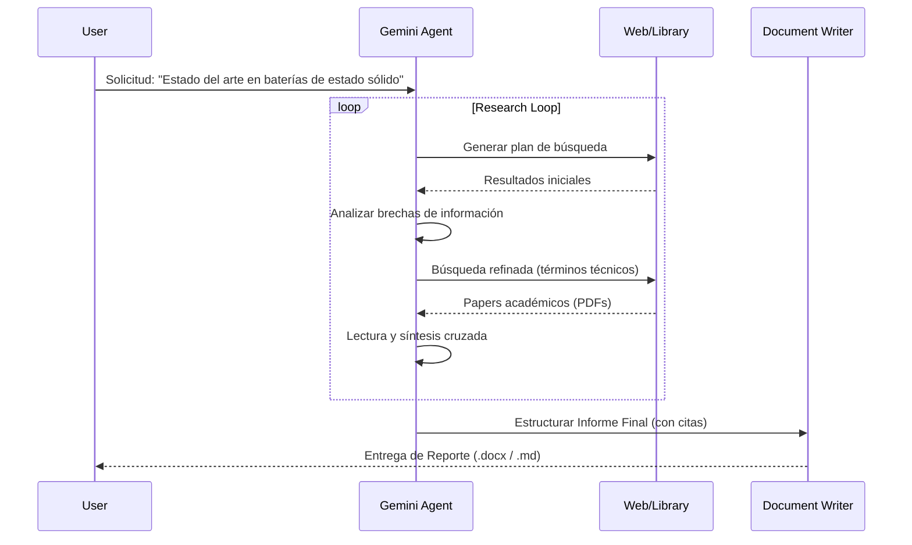

# Aplicación Gemini (Gemini 3 Pro Suited) 🧠

> **The Ultimate AI Research & Creation Assistant**
> *Acceso a la frontera de la inteligencia artificial: Razonamiento, Investigación Profunda y Generación Multimodal.*

---

## 🏢 Casos de Uso Startup: Productividad y Estrategia

### 1. Gestión Financiera (CFO Assistant)
Uso de **Gemini 3 Pro** para análisis de riesgos y proyecciones.
*   **Escenario**: Cierre trimestral y planificación de presupuestos.
*   **Prompt**: *"Actúa como un CFO experto. Sube el balance de sumas y saldos (CSV) y el extracto bancario. Identifica desviaciones mayores al 10% respecto al presupuesto inicial. Sugiere 3 áreas de reducción de costes operativos (OPEX) que no impacten en I+D."*
*   **Resultado**: Informe detallado con tablas y justificaciones estratégicas.

### 2. Vigilancia Tecnológica Profunda (Deep Research)
Investigación de competidores y patentes.
*   **Escenario**: Validar si una nueva feature que queremos desarrollar ya existe o está patentada.
*   **Acción**: Usar **Deep Research**.
*   **Prompt**: *"Realiza una investigación exhaustiva sobre sistemas de 'Agentes AI Multi-modales para HR' lanzados en los últimos 6 meses. Busca papers en ArXiv, lanzamientos en Product Hunt y patentes recientes. Crea una matriz comparativa de funcionalidades."*

### 3. Generación de Especificaciones Técnicas (CTO/Product Owner)
De idea abstracta a documento técnico listo para desarrollo.
*   **Escenario**: Definir la arquitectura de un nuevo microservicio.
*   **Prompt**: *"Escribe las especificaciones técnicas (PRD) para un sistema de notificaciones push escalable. Incluye diagrama de arquitectura en Mermaid, definición de endpoints API (OpenAPI 3.0), esquema de base de datos PostgreSQL y requisitos de latencia. Estilo técnico y conciso."*

### 4. Marketing SEO/SEM basado en IA
Generación de contenido optimizado y análisis de tendencias.
*   **Escenario**: Lanzamiento de campaña SEM.
*   **Acción**:
    1.  Pedir a Gemini analizar las keywords con mayor CPC y menor competencia en nuestro nicho.
    2.  Generar 50 variaciones de *ad copy* (títulos y descripciones) optimizados para CTR.
    3.  Crear la estructura de una Landing Page persuasiva basada en el marco AIDA.

---

## 🔬 Deep Research: Arquitectura de Investigación

**Deep Research** no es una simple búsqueda; es un proceso iterativo de agente autónomo que simula el flujo de trabajo de un investigador humano.

---

## 🛠️ Tutorial: Flujo de Trabajo Multimodal

### Objetivo: Crear una campaña de marketing desde cero

1.  **Brainstorming (Gemini 3 Pro)**:
    *   *Prompt*: "Actúa como un director creativo. Dame 5 conceptos disruptivos para una marca de zapatillas ecológicas."
2.  **Validación de Mercado (Deep Research)**:
    *   *Prompt*: "Investiga las tendencias de consumo de calzado sostenible en Gen Z para 2026. Busca competidores y precios." -> **Gemini genera un informe de 20 páginas.**
3.  **Visualización (Nano Banana Pro)**:
    *   *Prompt*: "Zapatilla hecha de musgo y material reciclado flotando en un bosque futurista, render 3D hiperrealista."
4.  **Prototipo de Anuncio (Veo 3.1)**:
    *   *Prompt*: "Video cinemático de la zapatilla aterrizando suavemente sobre una superficie de agua, slow motion, salpicaduras realistas."
