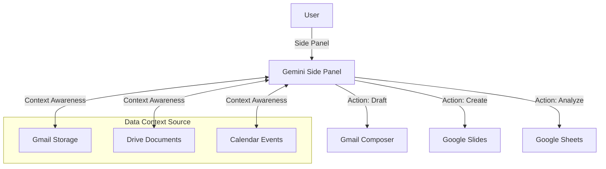

# Gemini for Google Workspace 💼

> **Native AI Integration Layer**
> *Productividad empresarial sin fricción integrada en el núcleo de Google Workspace.*

---

## 🏢 Casos de Uso Startup: Operaciones y Gestión Documental

### 1. Gestión Financiera Automatizada (Sheets)
Análisis de Cashflow sin fórmulas manuales.
*   **Caso**: Revisión mensual de gastos.
*   **Acción**:
    1.  Importar extracto bancario en Sheets.
    2.  Usar Gemini panel lateral: *"Clasifica estas transacciones en categorías (Nóminas, Servidores, Marketing, Oficina) y crea una tabla dinámica mostrando el gasto total por categoría y la variación mes a mes."*
    3.  *"Resalta en rojo cualquier gasto de suscripción recurrente que haya aumentado más de un 5%."*

### 2. Gestión de Clientes CRM (Gmail + Docs)
Respuesta a RFPs (Solicitudes de Propuesta) a velocidad luz.
*   **Caso**: Un cliente potencial envía un cuestionario de seguridad de 50 preguntas.
*   **Flujo**:
    1.  Subir la política de seguridad de la empresa a Drive.
    2.  Abrir el cuestionario en Docs/Sheets.
    3.  Invocar Gemini: *"Responde a estas preguntas basándote en nuestra Política de Seguridad v2026 almacenada en Drive."*
    4.  Revisión humana final y envío. Ahorro de 4 horas de trabajo manual.

### 3. Newsletter Corporativa y Comunicados (Docs + Gmail)
*   **Caso**: Email mensual a inversores.
*   **Acción**:
    *   En Docs, pedir a Gemini: *"Borrador de actualización para inversores. Hitos clave: Lanzamiento v2.0 (exitoso), +15% MRR, contratación nuevo CTO. Tono: Profesional pero optimista."*
    *   Exportar a Gmail y usar "Help me write" para pulir el asunto y hacerlo irresistible.

---

## 🔗 Ecosistema Conectado

Gemini no vive en una pestaña separada; es una capa de inteligencia que atraviesa todas las aplicaciones.

---

## 🛠️ Capacidades Técnicas por App

### 📧 Gmail
*   **Smart Reply 2.0**: No solo frases cortas. Puede redactar respuestas completas imitando tu tono basándose en tus enviados anteriores.
*   **Thread Summarization**: Algoritmo recursivo de resumen para hilos de +50 correos, destacando "Action Items" pendientes.

### 📄 Docs
*   **Inline Generation**: Escribe `/` para invocar el menú de IA.
*   **Estilo Adaptativo**: "Reescribe esto para que suene más profesional" o "Hazlo más conciso".
*   **Proofreading Avanzado**: Detección gramatical y de estilo superior al corrector ortográfico tradicional.

### 📊 Sheets (La joya oculta)
*   **Formula Generation**: `Help me organize -> "Calcula la tasa de crecimiento compuesto anual (CAGR) para la columna B y C"` -> Gemini escribe la fórmula compleja automáticamente.
*   **Data Classification**: Puede leer una columna de "Comentarios de clientes" y clasificarla automáticamente en una columna nueva como "Positivo", "Negativo" o "Queja de Envío".

### 📹 Vids (Nueva App)
Generador de video corporativo.
*   **Input**: Un documento de Google Docs (ej. "Plan de Ventas Q4").
*   **Process**: Gemini analiza el texto, extrae puntos clave, selecciona videos de stock, añade música y locución (Text-to-Speech).
*   **Output**: Un video presentación editable.
