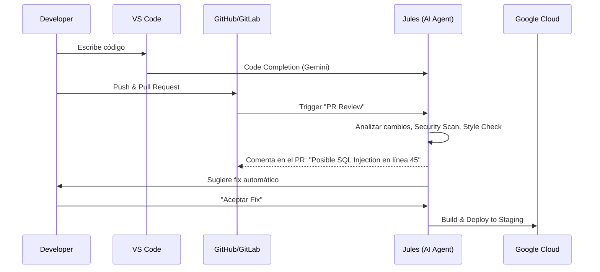

# Google Developer Program (Premium Tier) 👨‍💻

> **Accelerated Development Workflow**
> *Herramientas profesionales para ingenieros de software: Coding Assistant, CI/CD Agent y Cloud Credits.*

---

## 🏢 Casos de Uso Startup: Desarrollo (Vibecoding)

### 1. Desarrollo Rápido de Aplicaciones (Vibecoding)
Construcción de prototipos funcionales en tiempo real.
*   **Filosofía**: "Codificar por vibras" = Iteración rápida basada en lenguaje natural, dejando que la IA maneje la sintaxis.
*   **Flujo**:
    *   Prompt en IDE: *"Crea una API REST en FastAPI para un sistema de reservas. Usa Pydantic para validación. Añade un endpoint de 'analytics' que calcule la ocupación media."*
    *   Gemini genera todo el boilerplate, los modelos y la lógica de negocio.
    *   Dev: *"Ahora añade autenticación JWT"*. -> Gemini refactoriza e inyecta middleware de seguridad.
    *   Resultado: Backend funcional en 15 minutos en lugar de 4 horas.

### 2. Testing y QA Automatizado
Aseguramiento de calidad sin equipo de QA dedicado.
*   **Agente Jules**:
    *   Configuración: "Por cada Pull Request, genera casos de prueba unitarios para las nuevas funciones y verifica casos borde."
    *   Acción: Jules lee el código nuevo, entiende la lógica de negocio, escribe tests en `pytest`, los ejecuta y reporta cobertura. Si un test falla, sugiere el fix.

### 3. Mantenimiento y Refactorización (CIO)
Lucha contra la deuda técnica.
*   **Caso**: Un microservicio legacy en Python 2.7 está fallando.
*   **Acción**: *"Gemini, analiza este repositorio. Planifica y ejecuta una migración a Python 3.12, actualizando librerías obsoletas y reescribiendo patrones ineficientes."*

---

## 🤖 Jules: El Agente de CI/CD

"Jules" (nombre en clave) es el agente autónomo de ingeniería de Google. No solo autocompleta código; participa en el ciclo de vida del software.

---

## 💻 Gemini Code Assist (IDE Extension)

Integración profunda en VS Code, IntelliJ y Android Studio.

### Capacidades Pro
1.  **Full-Codebase Awareness**: A diferencia de Copilot básico, Gemini Pro indexa **todo tu repositorio local**. Puede sugerir cambios en `utils.py` basándose en cómo escribiste `main.py`.
2.  **Transformación de Código**:
    *   Selecciona una clase en Java.
    *   Prompt: *"Refactoriza esto a Kotlin idiomatico y añade tests unitarios con JUnit 5"*.
3.  **Chat en Contexto**: Pregunta *"¿Dónde se maneja la autenticación en este proyecto?"* y te llevará al archivo exacto.
