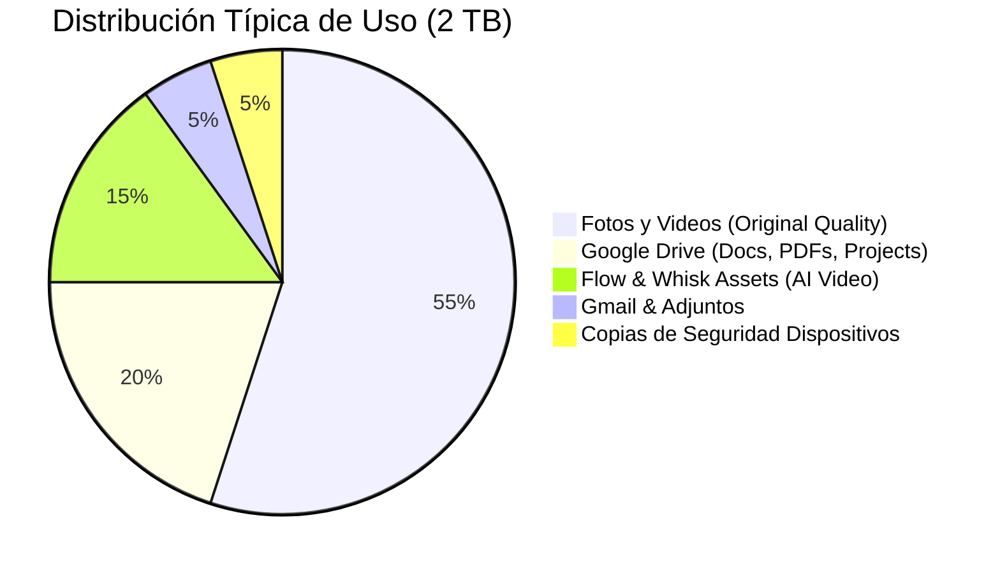

# Almacenamiento Cloud (2 TB) ☁️

> **Unified Storage Backbone**
> *La infraestructura de datos que soporta todo tu ecosistema de IA y archivos personales.*

---

## 🏢 Casos de Uso Startup: Gestión de Activos

### 1. Repositorio Central de "Knowledge Base" (Gestión Documental)
La fuente de verdad para los agentes RAG.
*   **Estrategia**: Crear una estructura de carpetas `_CORP_KNOWLEDGE` bien organizada en Drive.
*   **Uso**: Todos los manuales, políticas y especificaciones se guardan aquí. Esta carpeta es la que luego se indexa en **NotebookLM** y **Antigravity** para que los agentes de la empresa tengan contexto real. Sin estos 2TB, no hay "cerebro" corporativo.

### 2. Archivo de Media para Marketing
Gestión de assets pesados.
*   **Problema**: Los renders 4K de Flow y Whisk, y los archivos RAW de diseño ocupan mucho espacio.
*   **Solución**: Usar Drive como DAM (Digital Asset Management) ligero.
*   **Automatización**: Configurar una regla para que todo vídeo generado y aprobado se mueva automáticamente a una carpeta "Marketing_Approved_2026" compartida con la agencia/freelancers.

---

## 🗄️ Distribución Unificada

Google One no separa el almacenamiento. Es un "Data Lake" personal compartido.

---

## 🔒 Características de Seguridad

*   **Encriptación en Tránsito y Reposo**: Tus datos están cifrados con estándares AES-256.
*   **Dark Web Monitor**: Google escanea la "dark web" proactivamente para ver si tu email o datos personales han aparecido en brechas de seguridad de terceros y te avisa.
*   **VPN de Google One**: Incluida. Navegación cifrada en tu móvil y PC para protegerte en redes Wi-Fi públicas.
